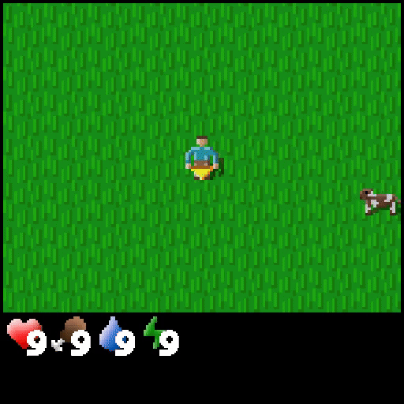

# BALROG DEMO

Record demonstrations for [BALROG](https://github.com/balrog-ai/BALROG)

### Installation
```bash
conda create -n demo python=3.10 -y
conda activate demo

git clone https://github.com/balrog-ai/balrog-demo.git
cd balrog-demo
pip install -e .[dev]
pre-commit install

# install balrog
pip install git+https://github.com/balrog-ai/BALROG.git
balrog-post-install
```

### Demonstrations
- each played episode: 
    - saves mp4 file for easy visualization
    - saves npz file for episode transitions
    - adds stats row in stats.jsonl
- we count transitions starting from env.reset
    - meaning that first transition has only obs, rest is set to none
- we don't save infos
- example video recorded:

</img>


### Play and record trajectories
Example for minihack:
```bash
python -m balrog_demo.envs.minihack.record_minihack --task MiniHack-Corridor-R3-v0 --record records --seed 0
```

Example for babyai:
```bash
python -m balrog_demo.envs.babyai.record_babyai --task BabyAI-MixedTrainLocal-v0.goto --record records --seed 0
```

### Play with text interface
Each of the environments can be played with text interface LLMs use. 
Example:

```bash
python -m balrog_demo.envs.minihack.record_minihack --task MiniHack-Corridor-R3-v0 --record records --seed 0 --text_observation True
```
Hint: You can use tabs for autocomplete and type `help` to display possible commands. 